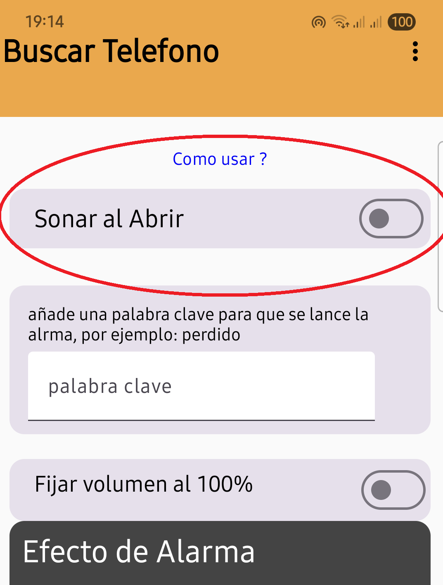
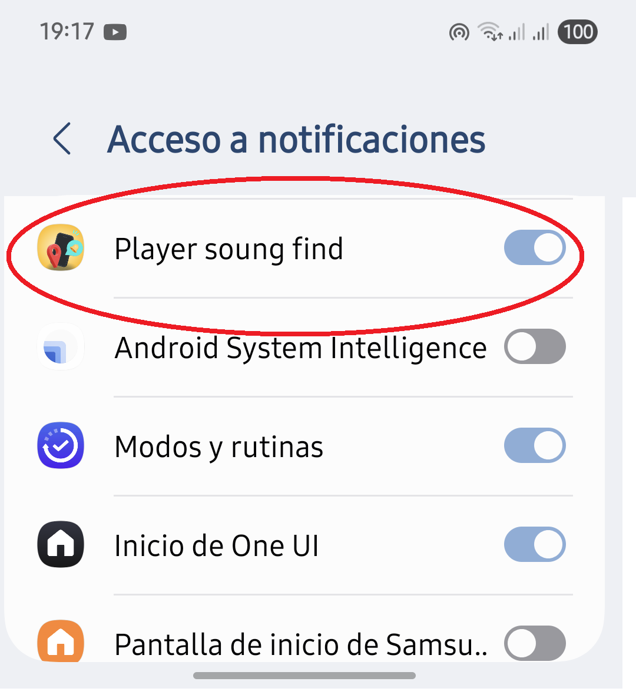
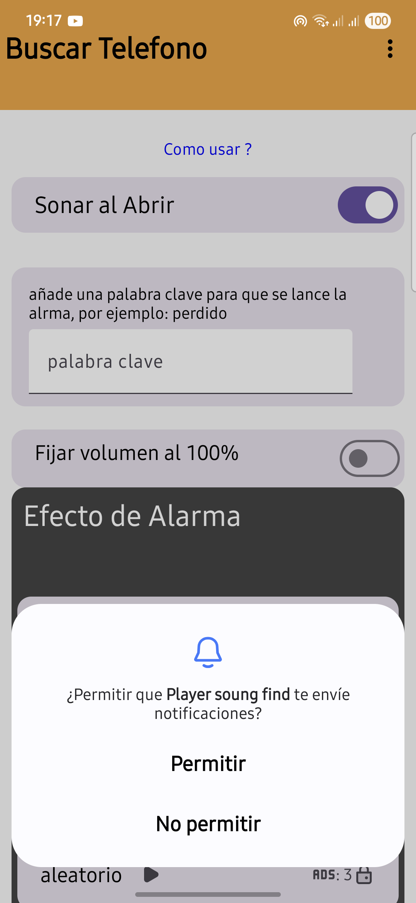

# 📱 Buscar Teléfono

**Buscar Teléfono** es una app Android que hace sonar tu dispositivo automáticamente cada vez que recibes una notificación que contiene una palabra clave definida por ti. Ideal para encontrar tu teléfono rápidamente si está perdido cerca de ti o en silencio.

---

## 🚀 Características

- 🔔 Detecta notificaciones entrantes en tiempo real.
- 🔑 Configura una palabra clave personalizada para activar la alarma.
- 📢 Reproduce un sonido fuerte para ayudarte a encontrar el dispositivo.
- 🔒 No recopila ningún dato personal ni accede a información sensible.

---

## 🖼️ Capturas de pantalla
activa la primera opcion

concede los permiso

permite las noitificaciones

---

## 🛠️ Instalación

### Desde APK

1. Descarga el archivo APK desde la [sección de releases](https://github.com/tuusuario/BuscarTelefono/releases).
2. Instala el APK en tu dispositivo Android.
3. Otorga los permisos solicitados al abrir la app.

